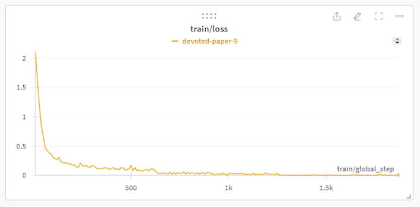
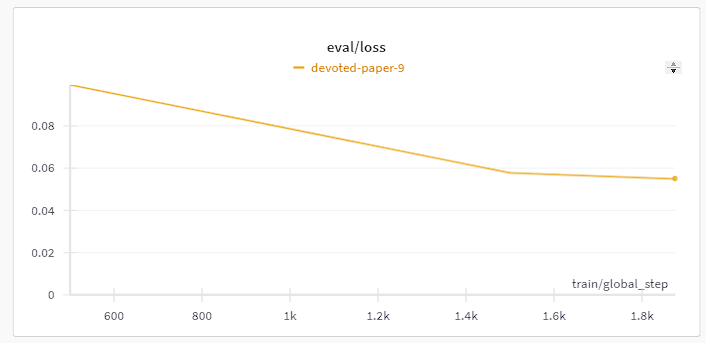
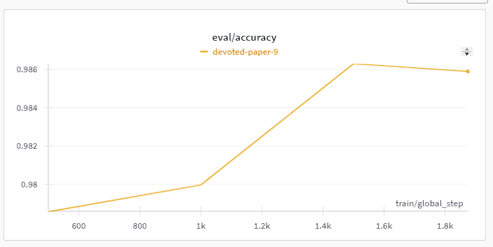
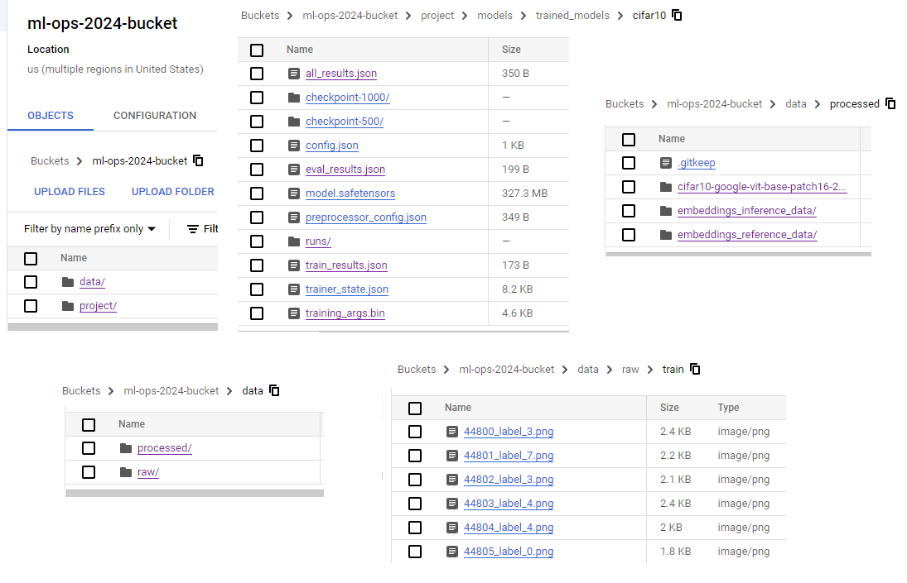
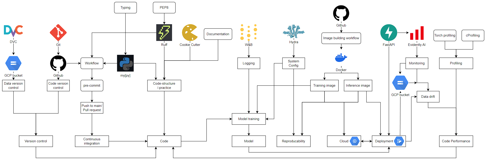

# Exam template for 02476 Machine Learning Operations

This is the report template for the exam. Please only remove the text formatted as with three dashes in front and behind
like:

```--- question 1 fill here ---```

where you instead should add your answers. Any other changes may have unwanted consequences when your report is auto
generated in the end of the course. For questions where you are asked to include images, start by adding the image to
the `figures` subfolder (please only use `.png`, `.jpg` or `.jpeg`) and then add the following code in your answer:

```markdown

```

In addition to this markdown file, we also provide the `report.py` script that provides two utility functions:

Running:

```bash
python report.py html
```

will generate an `.html` page of your report. After deadline for answering this template, we will autoscrape
everything in this `reports` folder and then use this utility to generate an `.html` page that will be your serve
as your final handin.

Running

```bash
python report.py check
```

will check your answers in this template against the constrains listed for each question e.g. is your answer too
short, too long, have you included an image when asked to.

For both functions to work it is important that you do not rename anything. The script have two dependencies that can
be installed with `pip install click markdown`.

## Overall project checklist

The checklist is *exhaustic* which means that it includes everything that you could possible do on the project in
relation the curricilum in this course. Therefore, we do not expect at all that you have checked of all boxes at the
end of the project.

### Week 1

* [x] Create a git repository
* [x] Make sure that all team members have write access to the github repository
* [x] Create a dedicated environment for you project to keep track of your packages
* [x] Create the initial file structure using cookiecutter
* [x] Fill out the `make_dataset.py` file such that it downloads whatever data you need and
* [x] Add a model file and a training script and get that running
* [x] Remember to fill out the `requirements.txt` file with whatever dependencies that you are using
* [x] Remember to comply with good coding practices (`pep8`) while doing the project
* [x] Do a bit of code typing and remember to document essential parts of your code
* [x] Setup version control for your data or part of your data
* [x] Construct one or multiple docker files for your code
* [x] Build the docker files locally and make sure they work as intended
* [x] Write one or multiple configurations files for your experiments
* [x] Used Hydra to load the configurations and manage your hyperparameters
* [x] When you have something that works somewhat, remember at some point to to some profiling and see if
      you can optimize your code
* [x] Use Weights & Biases to log training progress and other important metrics/artifacts in your code. Additionally,
      consider running a hyperparameter optimization sweep.
* [ ] Use Pytorch-lightning (if applicable) to reduce the amount of boilerplate in your code

### Week 2

* [x] Write unit tests related to the data part of your code
* [x] Write unit tests related to model construction and or model training
* [x] Calculate the coverage.
* [x] Get some continuous integration running on the github repository
* [x] Create a data storage in GCP Bucket for you data and preferable link this with your data version control setup
* [x] Create a trigger workflow for automatically building your docker images
* [x] Get your model training in GCP using either the Engine or Vertex AI
* [x] Create a FastAPI application that can do inference using your model
* [ ] If applicable, consider deploying the model locally using torchserve
* [x] Deploy your model in GCP using either Functions or Run as the backend

### Week 3

* [ ] Check how robust your model is towards data drifting
* [ ] Setup monitoring for the system telemetry of your deployed model
* [ ] Setup monitoring for the performance of your deployed model
* [ ] If applicable, play around with distributed data loading
* [ ] If applicable, play around with distributed model training
* [ ] Play around with quantization, compilation and pruning for you trained models to increase inference speed

### Additional

* [ ] Revisit your initial project description. Did the project turn out as you wanted?
* [ ] Make sure all group members have a understanding about all parts of the project
* [ ] Uploaded all your code to github

## Group information

### Question 1
> **Enter the group number you signed up on <learn.inside.dtu.dk>**
>
> Answer:

24

### Question 2
> **Enter the study number for each member in the group**
>
> Example:
>
> *sXXXXXX, sXXXXXX, sXXXXXX*
>
> Answer:

s194495, s204123, s204160

### Question 3
> **What framework did you choose to work with and did it help you complete the project?**
>
> Answer length: 100-200 words.
>
> Example:
> *We used the third-party framework ... in our project. We used functionality ... and functionality ... from the*
> *package to do ... and ... in our project*.
>
> Answer:

For this project we used the third-party framework [Huggingface’s transformers](https://huggingface.co/docs/transformers/index).
We chose the pre-trained Vision Transformer (ViT) model originally proposed in [# An Image is Worth 16x16 Words: Transformers for Image Recognition at Scale](https://arxiv.org/abs/2010.11929). We loaded this model using transformers' `ViTImageProcessor.from_pretrained()`. This allowed us to easily download and use a strong model.
We then used transformers' `TrainingArguments` and `Trainer` to finetune the model to CIFAR10.
Here we had to define some helper functions. Other than that the `Trainer` class did most of the work.

We also used `ViTImageProcessor` to process and transform the data to fit the models input.

We also used [Huggingface’s datasets](https://huggingface.co/docs/datasets/index) to find and load our data.

## Coding environment

> In the following section we are interested in learning more about you local development environment.

### Question 4

> **Explain how you managed dependencies in your project? Explain the process a new team member would have to go**
> **through to get an exact copy of your environment.**
>
> Answer length: 100-200 words
>
> Example:
> *We used ... for managing our dependencies. The list of dependencies was auto-generated using ... . To get a*
> *complete copy of our development environment, one would have to run the following commands*
>
> Answer:

We managed our environment dependencies through a requirements.txt file. Whenever we downloaded a package we added it to the requirements file. We ended up with a total of 3 requirements files, each for a specific use. One just to run the code using CUDA, One to run the code on CPU, and one to run tests on the code. To get a complete copy, one would then run pip install the requirements.txt. We found that the auto-generated requirements files, like `pip freeze > requirements.txt`, when installed often gave errors. Therefore, we opted to do it manually.

Additionally, we created a Docker image, that can run our code. So this could also be used to get an exact copy.

### Question 5

> **We expect that you initialized your project using the cookiecutter template. Explain the overall structure of your**
> **code. Did you fill out every folder or only a subset?**
>
> Answer length: 100-200 words
>
> Example:
> *From the cookiecutter template we have filled out the ... , ... and ... folder. We have removed the ... folder*
> *because we did not use any ... in our project. We have added an ... folder that contains ... for running our*
> *experiments.*
> Answer:

From the cookiecutter template, we have filled out the project, tests, reports, and model folders.
The project folder consists of data-handling code, in the data subfolder, and our model handling code in our model subfolder.
Our model handling code consists of our model creation and model training files.
We have removed the visualization code, as we deemed no visualizations other than WandB were needed.
Additionally, we have removed the notebooks and docs folder because we did not use any notebooks or mkdocs in our project.
We have added a FastAPI and Dockerfiles folder that contains code for running our FastAPI and Docker images.
						- OBS are we using these or??

### Question 6

> **Did you implement any rules for code quality and format? Additionally, explain with your own words why these**
> **concepts matters in larger projects.**
>
> Answer length: 50-100 words.
>
> Answer:

We enforce PEP8 code practice using ruff, and we also enforce typing with mypy.
We deem this important as it makes the code more transparent and understandable.
This is very important when multiple people are working on the same code, as code quickly becomes complex and hard to see through easily.
Here typing and documentation is essential.
Typing makes it easy at a quick glance to see what some function does.
and documentation gives more insight to the inner workings of each individual component.
We enforced these checks every time pushes to main were attempted.
The code could then only be pushed if it passed all tests.

We also wrote units-tests for our own functions.
## Version control

> In the following section we are interested in how version control was used in your project during development to
> corporate and increase the quality of your code.

### Question 7

> **How many tests did you implement and what are they testing in your code?**
>
> Answer length: 50-100 words.
>
> Example:
> *In total we have implemented X tests. Primarily we are testing ... and ... as these the most critical parts of our*
> *application but also ... .*
>
> Answer:

In total we have implemented 5 tests achieving test coverage of 85%.
Primarily we are testing function we have written ourselves.
This mainly includes data loading and helper functions for our third-party framework.
The data loading tests check if the data can be loaded, if the output of the dataloader as the expected shape, and if some random images and labels have the expected shape and type.

### Question 8

> **What is the total code coverage (in percentage) of your code? If you code had an code coverage of 100% (or close**
> **to), would you still trust it to be error free? Explain you reasoning.**
>
> Answer length: 100-200 words.
>
> Example:
> *The total code coverage of code is X%, which includes all our source code. We are far from 100% coverage of our **
> *code and even if we were then...*
>
> Answer:

As states above we achieve a code coverage of 85%.
If we achieved 100% we would still not trust that no error could occur.
This is because it is almost impossible to test every scenario possible we tests like these.
This can also be seen in real life, where people are being employed to find bugs in code.

Our code coverage does not include testing through testing of third party packages. We have chosen to assume that these do as expected.
For larger and more essential applications this would not be optimal, as these third party packages can change, thus impacting the code greatly.

### Question 9

> **Did you workflow include using branches and pull requests? If yes, explain how. If not, explain how branches and**
> **pull request can help improve version control.**
>
> Answer length: 100-200 words.
>
> Example:
> *We made use of both branches and PRs in our project. In our group, each member had an branch that they worked on in*
> *addition to the main branch. To merge code we ...*
>
> Answer:

In our group we made use of both branches and pull requests.
We made branches for specific topics, deleting them when the topic was concluded.
We did this so we could easily see what people were working on.
Additionally, this allows a good overview of prior work when visualizing the pushes to the branches and main.
Before any pull request was accepted to main the code had to be accepted by our GitHub workflow.
The workflow tested for a few main things.
1. set up python and install dependencies.
2. Lint with ruff
3. Authenticate gcloud
4. Pull data with dvc
5. test with pytest
6. Check types with mypy
Amount a few other small things.
- More details can be seen on github

### Question 10

> **Did you use DVC for managing data in your project? If yes, then how did it improve your project to have version**
> **control of your data. If no, explain a case where it would be beneficial to have version control of your data.**
>
> Answer length: 100-200 words.
>
> Example:
> *We did make use of DVC in the following way: ... . In the end it helped us in ... for controlling ... part of our*
> *pipeline*
>
> Answer:

We made use of DVC for managing our data.
Since we only worked with this project on a short time horizon the benefits of DVC were not as apparent as they would be with a long term project.
The main bonus of DVC is our case was, that DVC allowed cloud services to run without problems and that we made sure we all used the exact same data when running small tests and checks.
We also used DVC to store our models. This allowed easy transfer of models.
The benefits of DVC come into effect more on larger projects with more people on a longer time horizon.
Here the data might change more, and more people will need access to it. Therefore it also becomes important that everyone can easily make sure they work with the same data.
DVC also allows good error tracking, as you can see when errors occurred.

### Question 11

> **Discuss you continues integration setup. What kind of CI are you running (unittesting, linting, etc.)? Do you test**
> **multiple operating systems, python version etc. Do you make use of caching? Feel free to insert a link to one of**
> **your github actions workflow.**
>
> Answer length: 200-300 words.
>
> Example:
> *We have organized our CI into 3 separate files: one for doing ..., one for running ... testing and one for running*
> *... . In particular for our ..., we used ... .An example of a triggered workflow can be seen here: <weblink*
> Answer:


We have done three main things to reduce errors during continuous integration.
We wrote unit-tests for our own functions. This results in us knowing the individual functions do what we expect, and that they work with the expected input. Our unit tests achieve a coverage of 85%.

We also used pull requests to ensure that whenever something was push to main, it would always work.
To test if the push worked we would run it through a GitHub actions workflow.
The workflow can be seen here: (https://github.com/DrJupiter/ML-OPS-FINAL-24/blob/main/.github/workflows/python-app.yml)

Our workflow does not test multiple operating systems even through we use a split between Linux and Windows ourselves.
If we were to work with this for an extended time, we would implement this, as propagating errors across the systems would be a big problem.
Currently we only test on Linux, ubuntu-latest, to be more exact.
We chose this, because this is what our cloud servers would run on, and therefore docker etc.
We also only test for python 3.10 for similar reasons.

¤ belongs here??¤
We also developed a workflow for building our Docker image.
As such we could make sure that our image was always build the same way, and that we could build it in the cloud.
¤ belongs here??¤
If not we need to write a bit more

## Running code and tracking experiments

> In the following section we are interested in learning more about the experimental setup for running your code and
> especially the reproducibility of your experiments.

### Question 12

> **How did you configure experiments? Did you make use of config files? Explain with coding examples of how you would**
> **run a experiment.**
>
> Answer length: 50-100 words.
>
> Example:
> *We used a simple argparser, that worked in the following way: python my_script.py --lr 1e-3 --batch_size 25*
>
> Answer:

We used hydra as our config method. Therefore we have a file structure with .yaml files.
We opted for a simple structure, because of the simplicity of our code. Therefore we only have one .yaml file, containing all configs.

Below is an example of how to use hydra.
Hydra loads in the config file, which contains important information like can be seen below:
```python
@hydra.main(version_base=None, config_path="path/to/config/base", config_name="config")
def very_important_function(cfg):
	secret_of_the_universe = cfg.universe.secrects["most_important_secret"]
	answer_to_life = model.forward(secret_of_the_universe)
	return answer_to_life
```
We expect the above to return 42 in most cases.

TOO TROLL?
### Question 13

> **Reproducibility of experiments are important. Related to the last question, how did you secure that no information**
> **is lost when running experiments and that your experiments are reproducible?**
>
> Answer length: 100-200 words.
>
> Example:
> *We made use of config files. Whenever an experiment is run the following happens: ... . To reproduce an experiment*
> *one would have to do ...*
>
> Answer:

We made use of config files through hydra. The config file(s) helped us setting all seeds to the same each time, ensuring that we always used the same initial seeds.
As such if you were to run the experiment again, you would get the exact same output.
Additionally, we created a Docker image. Docker images allow easy reproducibility across different hardware and software.
These two things combined made our experiments very reproducible.

To reproduce our results one would have to:
Clone our GitHub repository.
Run the Docker image with the desired goal. We have a Docker image for XXX and XXX. This would then create a Docker container that the user could run for the desired purpose.
Since we use identical config and Docker the results would then be the exact same.
### Question 14

> **Upload 1 to 3 screenshots that show the experiments that you have done in W&B (or another experiment tracking**
> **service of your choice). This may include loss graphs, logged images, hyperparameter sweeps etc. You can take**
> **inspiration from [this figure](figures/wandb.png). Explain what metrics you are tracking and why they are**
> **important.**
>
> Answer length: 200-300 words + 1 to 3 screenshots.
>
> Example:
> *As seen in the first image when have tracked ... and ... which both inform us about ... in our experiments.*
> *As seen in the second image we are also tracking ... and ...*
>
> Answer:

--- question 14 fill here ---

We used WandB as our logging software for our transformer based classification model.
We tested training the Vision Transformer (ViT) model proposed in [# An Image is Worth 16x16 Words: Transformers for Image Recognition at Scale](https://arxiv.org/abs/2010.11929) On the [CIFAR10](https://paperswithcode.com/dataset/cifar-10) dataset.
Below we will discuss images of our main graph for training and validation.

First we look at the loss curve for our model over its 1870 training steps.
Below we see the loss curve for our model:

We see that the loss falls over time, meaning that the model is improving.
It starts slightly above 2 and goes down to 0.0067, meaning that the loss got almost 300 times better.

To that the model is actually improving, we look at the validation loss over time:

We also see that the loss deceases over time.
This also suggest that the model is improving.
The model falls from 0.099 to 0.055, thus the validation loss is about half the original.

To confirm what this actually means for our model, and how good it actually became we look at the classification accuracy.

We see that the performance goes up over time, achieving above 98% accuracy.
We also notice that the model achieves good performance quite early one. Already at the first validation test, it almost achieves 98%.
### Question 15

> **Docker is an important tool for creating containerized applications. Explain how you used docker in your**
> **experiments? Include how you would run your docker images and include a link to one of your docker files.**
>
> Answer length: 100-200 words.
>
> Example:
> *For our project we developed several images: one for training, inference and deployment. For example to run the*
> *training docker image: `docker run trainer:latest lr=1e-3 batch_size=64`. Link to docker file: <weblink\>*
>
> Answer:

(docker-link)[https://hub.docker.com/repository/docker/drjupiter/mlops24/general]
--------- question 15 fill here --------------

### Question 16

> **When running into bugs while trying to run your experiments, how did you perform debugging? Additionally, did you**
> **try to profile your code or do you think it is already perfect?**
>
> Answer length: 100-200 words.
>
> Example:
> *Debugging method was dependent on group member. Some just used ... and others used ... . We did a single profiling*
> *run of our main code at some point that showed ...*
>
> Answer:

Debugging in our group was done in X main ways. (add more ways if anyone else did anything else)
We used the debugger in vs-code to find potential bugs.
This tool is easy to use, but quite powerful.

We did performed both torch profiling and cprofiling on our inference code (on CPU, as the person performing doesn't have NVIDIA GPU).
In the run we did 10 model predictions on different images. These runs also included everything excluding imports (the data had already been loaded locally).

The torch profiling runs shows that torch Linear (and thus torch.addmm) are the bottleneck with almost 90% of the CPU time spent on these functions.
It makes a lot of sense that these function take up most of the time, as they are a large part of what defines an NN.
The next things unrelated to the above are softmax (3% of the time), copy (0.84%) and layer norm (0.62%).

The cProfiling showed that again torch.nn.linear was taking up the most tottime (20% of total time) seconded by reading of SSLSocket objects (14%). Non of our functions are in top 10 of tottime spenders.

Thus we conclude that our code is not a bottleneck and works efficient enough.
## Working in the cloud

> In the following section we would like to know more about your experience when developing in the cloud.

### Question 17

> **List all the GCP services that you made use of in your project and shortly explain what each service does?**
>
> Answer length: 50-200 words.
>
> Example:
> *We used the following two services: Engine and Bucket. Engine is used for... and Bucket is used for...*
>
> Answer:

Bucket / cloud storage
- A place to store data in the cloud. We used it to store our data.

Compute engine
- A place to create and access an online server using either a CPU or GPU. These instances can then be used to perform tasks.

which others did you guys end up using?
- Cloud functions?
- Triggers
- Cloud machine learning (i think not but maybe)
- Cloud console?
- Container registry?


### Question 18

> **The backbone of GCP is the Compute engine. Explained how you made use of this service and what type of VMs**
> **you used?**
>
> Answer length: 100-200 words.
>
> Example:
> *We used the compute engine to run our ... . We used instances with the following hardware: ... and we started the*
> *using a custom container: ...*
>
> Answer:


--- question 18 fill here ---

### Question 19

> **Insert 1-2 images of your GCP bucket, such that we can see what data you have stored in it.**
> **You can take inspiration from [this figure](figures/bucket.png).**
>
> Answer:

Main folder top right.

### Question 20

> **Upload one image of your GCP container registry, such that we can see the different images that you have stored.**
> **You can take inspiration from [this figure](figures/registry.png).**
>
> Answer:

--- question 20 fill here ---

### Question 21

> **Upload one image of your GCP cloud build history, so we can see the history of the images that have been build in**
> **your project. You can take inspiration from [this figure](figures/build.png).**
>
> Answer:

--- question 21 fill here ---

### Question 22

> **Did you manage to deploy your model, either in locally or cloud? If not, describe why. If yes, describe how and**
> **preferably how you invoke your deployed service?**
>
> Answer length: 100-200 words.
>
> Example:
> *For deployment we wrapped our model into application using ... . We first tried locally serving the model, which*
> *worked. Afterwards we deployed it in the cloud, using ... . To invoke the service an user would call*
> *`curl -X POST -F "file=@file.json"<weburl>`*
>
> Answer:

--- question 22 fill here ---

### Question 23

> **Did you manage to implement monitoring of your deployed model? If yes, explain how it works. If not, explain how**
> **monitoring would help the longevity of your application.**
>
> Answer length: 100-200 words.
>
> Example:
> *We did not manage to implement monitoring. We would like to have monitoring implemented such that over time we could*
> *measure ... and ... that would inform us about this ... behaviour of our application.*
>
> Answer:

--- question 23 fill here ---

### Question 24

> **How many credits did you end up using during the project and what service was most expensive?**
>
> Answer length: 25-100 words.
>
> Example:
> *Group member 1 used ..., Group member 2 used ..., in total ... credits was spend during development. The service*
> *costing the most was ... due to ...*
>
> Answer:

--- question 24 fill here ---

## Overall discussion of project

> In the following section we would like you to think about the general structure of your project.

### Question 25

> **Include a figure that describes the overall architecture of your system and what services that you make use of.**
> **You can take inspiration from [this figure](figures/overview.png). Additionally in your own words, explain the**
> **overall steps in figure.**
>
> Answer length: 200-400 words
>
> Example:
>
> *The starting point of the diagram is our local setup, where we integrated ... and ... and ... into our code.*
> *Whenever we commit code and puch to github, it auto triggers ... and ... . From there the diagram shows ...*
>
> Answer:



The image above describes the architecture of our system, and how all services interact with each other on a general level.
The graph is built around the main pillars discussed in the course with a few additions for connectivity.
These main pillars are: Version control, Continuous integration, reproducibility, cloud, and deployment.
Additionally we have added, code, model and code performance to signify other crucial parts not easily encompassed in the pillars above.

Near the top we have concepts or services used in the project. These include DVC, Git, Ruff etc.
These then lead into concepts, implementations or other services.
Ex:
- Git leads to GitHub, as we use GitHub to host our Git repository.
- Ruff leads to code-structure/-practice, as it helps enforce good structure and practice directly in our code.
- FastAPI leads into Evidently AI, as we use FastAPI to serve our Evidently AI monitoring.

At he lowest level we see the main pillars our structure revolves around, and how these interact.
We also see that Cloud is being served by GCP `compute engine` and that Deployment is being served by GCP `Cloud run`.

Logos represent services we have used.
Boxes with rounded corners represent ideas or other services we are using. ex we deem pre-commit as a service we are using.
Boxes with sharp corners represent more general concepts or implementations.

For an example on how to understand it we look at deployment.
We see that deployment depends on FastAPI and cloud, as it is being served on the cloud using FastAPI.
We also see that the deployment depends on the model and the inference Docker image, as both of these are needed to perform inference and therefore the deployment of our model.
We  then also see that the deployment leads into data drift and GCP `Bucket` as we record the given images to estimate if we encounter data drift, and therefore need to update our model.

### Question 26

> **Discuss the overall struggles of the project. Where did you spend most time and what did you do to overcome these**
> **challenges?**
>
> Answer length: 200-400 words.
>
> Example:
> *The biggest challenges in the project was using ... tool to do ... . The reason for this was ...*
>
> Answer:

The biggest challenge in our project was Docker.
Getting the Docker image up and running locally wasn't the biggest problem.
The problem was using and creating it in the cloud.
... MORE DEATILS ...

Workflow to create Docker image:
- GPU version took too much space, so we only created a CPU version in the cloud
### Question 27

> **State the individual contributions of each team member. This is required information from DTU, because we need to**
> **make sure all members contributed actively to the project**
>
> Answer length: 50-200 words.
>
> Example:
> *Student sXXXXXX was in charge of developing of setting up the initial cookie cutter project and developing of the*
> *docker containers for training our applications.*
> *Student sXXXXXX was in charge of training our models in the cloud and deploying them afterwards.*
> *All members contributed to code by...*
>
> Answer:


Student s194495 (Johan)
- Code setup (CookieCutter, hydra, W&B, DVC)
- Got code up training and inference on local machine up and running (initial model)
- FastAPI (and Evidently AI)
- Project writing (assisted)

Student s204123 (Klaus)
- Creating Docker image in cloud
- pre-commit
- GitHub workflow (Ruff, mypy, pull-request)
- Project writing (assisted)

Student s204160 (Andreas)
- Writing documentation,
- Writing unit-tests,
- Typing,
- Profiling
- Project writing.
