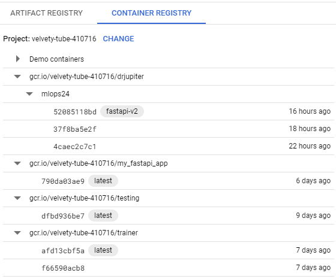
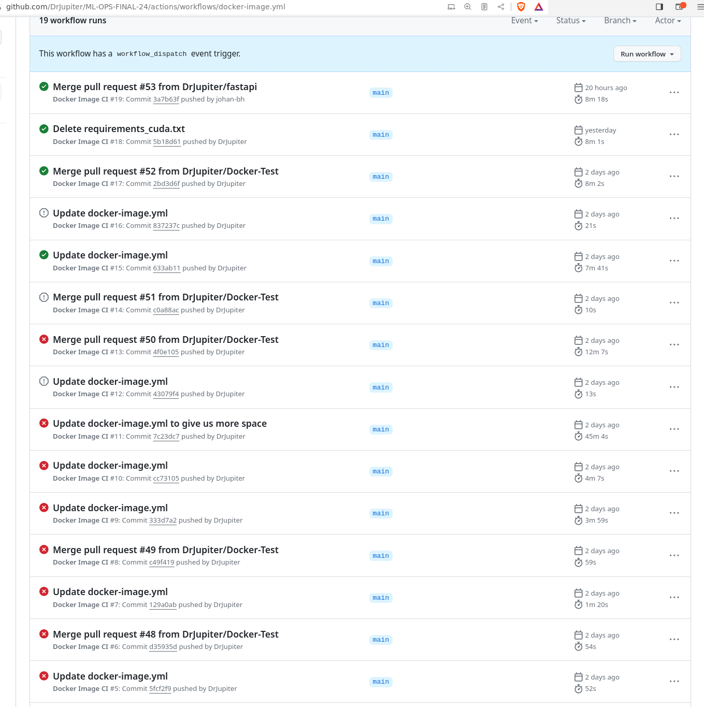
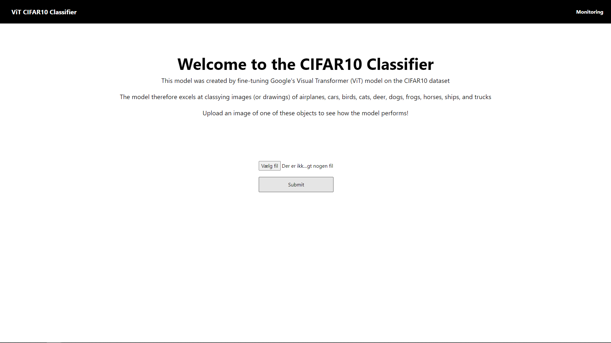
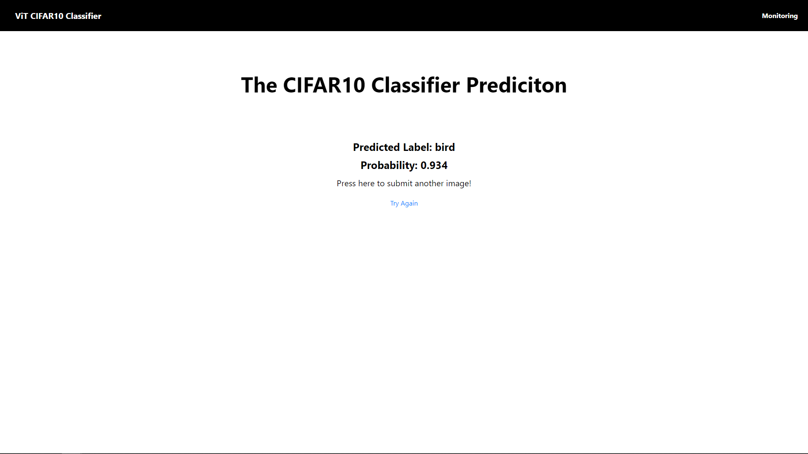
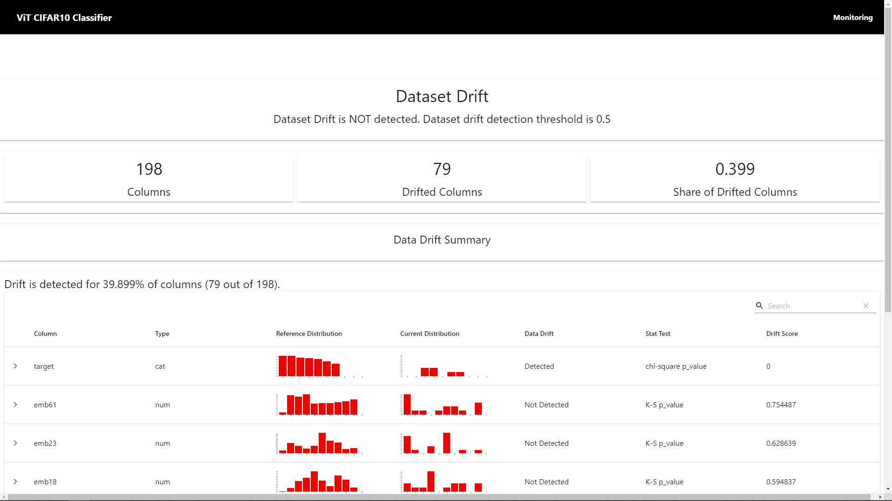
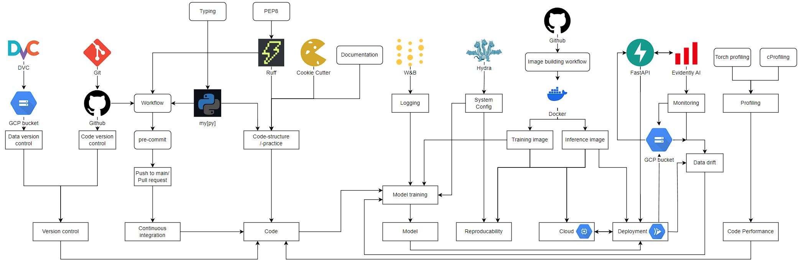

# Exam template for 02476 Machine Learning Operations

This is the report template for the exam. Please only remove the text formatted as with three dashes in front and behind
like:

```--- question 1 fill here ---```

where you instead should add your answers. Any other changes may have unwanted consequences when your report is auto
generated in the end of the course. For questions where you are asked to include images, start by adding the image to
the `figures` subfolder (please only use `.png`, `.jpg` or `.jpeg`) and then add the following code in your answer:

```markdown

```

In addition to this markdown file, we also provide the `report.py` script that provides two utility functions:

Running:

```bash
python report.py html
```

will generate an `.html` page of your report. After deadline for answering this template, we will autoscrape
everything in this `reports` folder and then use this utility to generate an `.html` page that will be your serve
as your final handin.

Running

```bash
python report.py check
```

will check your answers in this template against the constrains listed for each question e.g. is your answer too
short, too long, have you included an image when asked to.

For both functions to work it is important that you do not rename anything. The script have two dependencies that can
be installed with `pip install click markdown`.

## Overall project checklist

The checklist is *exhaustic* which means that it includes everything that you could possible do on the project in
relation the curricilum in this course. Therefore, we do not expect at all that you have checked of all boxes at the
end of the project.

### Week 1

* [x] Create a git repository
* [x] Make sure that all team members have write access to the github repository
* [x] Create a dedicated environment for you project to keep track of your packages
* [x] Create the initial file structure using cookiecutter
* [x] Fill out the `make_dataset.py` file such that it downloads whatever data you need and
* [x] Add a model file and a training script and get that running
* [x] Remember to fill out the `requirements.txt` file with whatever dependencies that you are using
* [x] Remember to comply with good coding practices (`pep8`) while doing the project
* [x] Do a bit of code typing and remember to document essential parts of your code
* [x] Setup version control for your data or part of your data
* [x] Construct one or multiple docker files for your code
* [x] Build the docker files locally and make sure they work as intended
* [x] Write one or multiple configurations files for your experiments
* [x] Used Hydra to load the configurations and manage your hyperparameters
* [x] When you have something that works somewhat, remember at some point to to some profiling and see if
      you can optimize your code
* [x] Use Weights & Biases to log training progress and other important metrics/artifacts in your code. Additionally,
      consider running a hyperparameter optimization sweep.
* [ ] Use Pytorch-lightning (if applicable) to reduce the amount of boilerplate in your code
* [x] Use Huggingface (if applicable) to reduce the amount of boilerplate in your code

### Week 2

* [x] Write unit tests related to the data part of your code
* [x] Write unit tests related to model construction and or model training
* [x] Calculate the coverage.
* [x] Get some continuous integration running on the github repository
* [x] Create a data storage in GCP Bucket for you data and preferable link this with your data version control setup
* [x] Create a trigger workflow for automatically building your docker images
* [x] Get your model training in GCP using either the Engine or Vertex AI
* [x] Create a FastAPI application that can do inference using your model
* [ ] If applicable, consider deploying the model locally using torchserve
* [x] Deploy your model in GCP using either Functions or Run as the backend

### Week 3

* [ ] Check how robust your model is towards data drifting
* [x] Setup monitoring for the system telemetry of your deployed model
* [x] Setup monitoring for the performance of your deployed model
* [ ] If applicable, play around with distributed data loading
* [ ] If applicable, play around with distributed model training
* [ ] Play around with quantization, compilation and pruning for you trained models to increase inference speed

### Additional

* [ ] Revisit your initial project description. Did the project turn out as you wanted?
* [ ] Make sure all group members have a understanding about all parts of the project
* [ ] Uploaded all your code to github

## Group information

### Question 1 [✔]
> **Enter the group number you signed up on <learn.inside.dtu.dk>**
>
> Answer:

24.

### Question 2 [✔]
> **Enter the study number for each member in the group**
>
> Example:
>
> *sXXXXXX, sXXXXXX, sXXXXXX*
>
> Answer:

s194495, s204123, s204160.


### Question 3 [✔]
> **What framework did you choose to work with and did it help you complete the project?**
>
> Answer length: 100-200 words.
>
> Example:
> *We used the third-party framework ... in our project. We used functionality ... and functionality ... from the*
> *package to do ... and ... in our project*.
>
> Answer:

For this project we used the third-party framework [Huggingface’s transformers](https://huggingface.co/docs/transformers/index).
We chose the pre-trained Vision Transformer (ViT) model originally proposed in [n Image is Worth 16x16 Words: Transformers for Image Recognition at Scale](https://arxiv.org/abs/2010.11929). We loaded this model using transformers' `ViTImageProcessor.from_pretrained()`.
We then used transformers `TrainingArguments` and `Trainer` to finetune the model to CIFAR10.
The `ViT` framework also included helper functions for data preprocessing.
We used these helper functions to build the data loader.
We downloaded our data with [Huggingface’s datasets](https://huggingface.co/docs/datasets/index).
To tie it all together we had to write a few helper functions. In general, the framework made it much easier to implement and fine-tune a visual Transformer model. There was significantly less boilerplate code and we were able to focus on ML Ops rather than the complex underpinnings of the model architecture and setup.


## Coding environment

> In the following section we are interested in learning more about you local development environment.

### Question 4 [✔] Johan

> **Explain how you managed dependencies in your project? Explain the process a new team member would have to go**
> **through to get an exact copy of your environment.**
>
> Answer length: 100-200 words
>
> Example:
> *We used ... for managing our dependencies. The list of dependencies was auto-generated using ... . To get a*
> *complete copy of our development environment, one would have to run the following commands*
>
> Answer:

We manage our Python dependencies for local development and docker CPU
builds in the [requirements.txt](https://github.com/DrJupiter/ML-OPS-FINAL-24/blob/main/requirements.txt) file.
When we download a new package, we add it to the requirements file. _(We don't use `pipreqs`, because the requirements.txt it generated didn't work properly, when running `pip install -r requirements.txt`)_.
One should run `pip install -r requirements.txt` to obtain a copy of our development environment.

In the project, we also have a requirements file: [requirements_docker_gpu.txt](https://github.com/DrJupiter/ML-OPS-FINAL-24/blob/main/requirements_docker_gpu.txt), which is only to be used, when building the docker image to run on the gpu.
_The difference between the `requirements` and `requirements_docker_cpu` is the later doesn't install pytorch as a version compiled by NVIDIA is used instead._

Lastly, we have a `fastapi_requirements.txt` in the fastapi folder that specifies the dependencies required to run the application. If one wants to replicate our FastAPI application they could simply build the image using the Dockerfile in the fastapi directory and push the image to GCP's Container Registry from where the image can be deployed to Cloud Run.

<!-- Additionally we created a Docker image, that can run our code. So this could also be used to get an exact copy. -->

### Question 5 [x]

> **We expect that you initialized your project using the cookiecutter template. Explain the overall structure of your**
> **code. Did you fill out every folder or only a subset?**
>
> Answer length: 100-200 words
>
> Example:
> *From the cookiecutter template we have filled out the ... , ... and ... folder. We have removed the ... folder*
> *because we did not use any ... in our project. We have added an ... folder that contains ... for running our*
> *experiments.*
> Answer:

From the [cookiecutter template](https://github.com/SkafteNicki/mlops_template) we have filled out the folders for: project, tests, reports, and model.
The project folder consists of data-handling code, in the data subfolder, and our model handling code in our model subfolder.
Our model handling code consists of our model creation and model training files.
We have removed the visualization code, as we deemed no visualizations other than WandB were needed.
Additionally, we have removed the notebooks and docs folder because we did not use any notebooks or mkdocs in our project.
We have added a FastAPI and Dockerfiles folder that contains code for running our FastAPI and building our Docker images.


### Question 6 [x]

> **Did you implement any rules for code quality and format? Additionally, explain with your own words why these**
> **concepts matters in larger projects.**
>
> Answer length: 50-100 words.
>
> Answer:

We enforce PEP8 and format our code with [ruff](https://github.com/astral-sh/ruff), and we also enforce typing with [mypy](https://github.com/python/mypy). <!-- These tools help us keep our code transparent and more understandable. -->
We deem this important as it makes the code more transparent and understandable. This increases the reproducibility of our project.
Readability and transparency are very important when multiple people are working on the same code, as code quickly becomes complex and hard to see through easily.
We also require supplying documentation for essential functions (We check this manually.).
Formatting, typing, and documentation make our code more readable and easy to understand.

We enforce formatting and typing, whenever a pull request is made to the main branch.
The main branch cannot be pushed before the GitHub action which checks these aforementioned things is successful.
The action also tests our code, which we will go into in the next question.

## Version control

> In the following section we are interested in how version control was used in your project during development to
> corporate and increase the quality of your code.

### Question 7 [] Andreas (done)

> **How many tests did you implement and what are they testing in your code?**
>
> Answer length: 50-100 words.
>
> Example:
> *In total we have implemented X tests. Primarily we are testing ... and ... as these the most critical parts of our*
> *application but also ... .*
>
> Answer:

In total, we have implemented 5 tests achieving test coverage of 85%.
We primarily test functions we have written ourselves.
Our tests are for data loading, model, and training helper functions for our third-party framework.

The data loading tests check if the data can be loaded if the output of the dataloader has the expected shape, and if some random images and labels have the expected shape and type.

We tested if the metrics from evaluate were correct if the feature transformer actually transformed to the expected shape, and if the collator correctly restructured the data.

### Question 8 [Done] Klaus

> **What is the total code coverage (in percentage) of your code? If you code had an code coverage of 100% (or close**
> **to), would you still trust it to be error free? Explain you reasoning.**
>
> Answer length: 100-200 words.
>
> Example:
> *The total code coverage of code is X%, which includes all our source code. We are far from 100% coverage of our **
> *code and even if we were then...*
>
> Answer:

As stated above, we achieve a code coverage of 85%.
If we achieved 100% we would still not trust that no error could occur.
<!-- This is because it is almost impossible to test every scenario possible with tests like these. __We should explain why.__ -->
Even if we test all functions it doesn't mean they all work perfectly in all cases.
Furthermore, a coverage test only tests how much of the code base is running which does not equate to test coverage of the actual functionality.
To achieve better testing for a large scale project, one might employ or assign people to find bugs.


Our code coverage does not include testing of third-party packages.
We have chosen to assume that these do as expected.
Testing of model loading was not implemented as it is quite demanding in terms of memory requirements.
For larger and more essential applications this would not be optimal, as these third-party packages can change with new updates, thus impacting the code greatly.

### Question 9 [x]

> **Did your workflow include using branches and pull requests? If yes, explain how. If not, explain how branches and**
> **pull request can help improve version control.**
>
> Answer length: 100-200 words.
>
> Example:
> *We made use of both branches and PRs in our project. In our group, each member had an branch that they worked on in*
> *addition to the main branch. To merge code we ...*
>
> Answer:

In our group, we made use of both branches and pull requests.
We made branches for specific topics, deleting them when the topic was concluded.
We did this so we could easily see what people were working on.
And if multiple people are working on the same thing they can do so.
Additionally, this allows a good overview of prior work when visualizing the pushes to the branches and main.
Before any pull request was accepted to main the code had to be accepted by our GitHub workflow.
The workflow tested for a few main things.
1. Set up Python and install dependencies.
2. Lint with ruff
3. Pull data with DVC
4. Test with PyTest
5. Check types with mypy
> More details can be seen on GitHub

### Question 10 [x]

> **Did you use DVC for managing data in your project? If yes, then how did it improve your project to have version**
> **control of your data. If no, explain a case where it would be beneficial to have version control of your data.**
>
> Answer length: 100-200 words.
>
> Example:
> *We did make use of DVC in the following way: ... . In the end it helped us in ... for controlling ... part of our*
> *pipeline*
>
> Answer:

In our project, we utilized Data Version Control (DVC) to manage our data. However, given the short duration of our project, the advantages of DVC weren't as evident. The primary benefit we experienced was DVC's seamless integration with cloud services, ensuring consistent data usage across various tests and checks.

DVC's effectiveness is more pronounced in larger, long-term projects involving more team members, particularly in sectors like Data Security where data is constantly incoming. In such environments, frequent data changes and the need for multiple access points make it crucial for everyone to work with the same data set. Effective data tagging by the development team enhances this process, allowing for the restoration of previous data versions if errors arise.

### Question 11 [Done] Klaus

> **Discuss your continuous integration setup. What kind of CI are you running (unittesting, linting, etc.)? Do you test**
> **multiple operating systems, python version etc. Do you make use of caching? Feel free to insert a link to one of**
> **your github actions workflow.**
>
> Answer length: 200-300 words.
>
> Example:
> *We have organized our CI into 3 separate files: one for doing ..., one for running ... testing and one for running*
> *... . In particular for our ..., we used ... .An example of a triggered workflow can be seen here: <weblink*
> Answer:


We have two main actions; one for the [python code](https://github.com/DrJupiter/ML-OPS-FINAL-24/actions/workflows/python-app.yml) we write, and another for [building and pushing a docker image](https://github.com/DrJupiter/ML-OPS-FINAL-24/actions/workflows/docker-image.yml). We also have a (pre-commit config)[https://github.com/DrJupiter/ML-OPS-FINAL-24/blob/main/.pre-commit-config.yaml] to format code and statically check for types and a few other things.
The pre-commit helps us keep our code clean and maintainable.

The action for the python code is activated when we push to main and create a pull request to main. It starts by checking out our branch, and setting up our python environment by installing the packages in the requirements.txt on Ubuntu’s latest os release.
The code is then checked and formatted with ruff. Our data is then pulled with dvc from our bucket. Having the data allows us to also test our functions which rely on it. We then run the tests. Finally we check for types with mypy.
We trust that if this action passes, our code runs as intended for our project.

The action for building and pushing the docker-file is activated when code is pushed to main.
It runs the `train_model.dockerfile` and pushes it to the docker hub.

We do not test on multiple operating systems, only ubuntu/debian. If we intended this project to be developed for longer and on multiple OSes, we would test on them too. The docker container we build uses the same OS that we test on, and thus, we think our checks guarantee our project and image will run.


## Running code and tracking experiments

> In the following section we are interested in learning more about the experimental setup for running your code and
> especially the reproducibility of your experiments.

### Question 12 [x]

> **How did you configure experiments? Did you make use of config files? Explain with coding examples of how you would**
> **run a experiment.**
>
> Answer length: 50-100 words.
>
> Example:
> *We used a simple argparser, that worked in the following way: python my_script.py --lr 1e-3 --batch_size 25*
>
> Answer:

We used hydra as our config method. Therefore we have a file structure with .yaml files.
We opted for a simple structure, because of the simplicity of our code. Therefore we only have one .yaml file, containing all configs.

Below is an example of how to use hydra.
Hydra loads in the config file, which contains important information for the process. This can be seen below:
```python
@hydra.main(config_path="path/to/config/base", config_name="config")
def very_important_function(cfg):
	secret_of_the_universe = cfg.universe.secrects["most_important_secret"]
	model_answering_life = Model(secret_of_the_universe)
	return model_answering_life
```
To run a different experiment (different model), we would change the config file.
<!-- We expect the above to return 42 in most cases. -->
### Question 13 [x]

> **Reproducibility of experiments are important. Related to the last question, how did you secure that no information**
> **is lost when running experiments and that your experiments are reproducible?**
>
> Answer length: 100-200 words.
>
> Example:
> *We made use of config files. Whenever an experiment is run the following happens: ... . To reproduce an experiment*
> *one would have to do ...*
>
> Answer:

We made use of config file(s) through Hydra. The config file(s) helped us set all seeds to the same each time, ensuring that we always used the same initial seeds.
As such if you were to run the experiment again, you would get the same output.
Additionally, we created a Docker image. Docker images allow easy reproducibility across different hardware and software, as the resulting Docker container would be identical across different systems.
These two things combined made our experiments very reproducible.
If one wishes to run a particular experiment, the corresponding docker image can be found on Docker hub.
This is because changing the config requires building a new image.
Thus each image is associated with a specific config file/experiment.
### Question 14 [] Andreas (done)

> **Upload 1 to 3 screenshots that show the experiments that you have done in W&B (or another experiment tracking**
> **service of your choice). This may include loss graphs, logged images, hyperparameter sweeps etc. You can take**
> **inspiration from [this figure](figures/wandb.png). Explain what metrics you are tracking and why they are**
> **important.**
>
> Answer length: 200-300 words + 1 to 3 screenshots.
>
> Example:
> *As seen in the first image when have tracked ... and ... which both inform us about ... in our experiments.*
> *As seen in the second image we are also tracking ... and ...*
>
> Answer:

We used W&B as our logging software for our transformer based classification model.
We tested training the Vision Transformer (ViT) model proposed in [An Image is Worth 16x16 Words: Transformers for Image Recognition at Scale](https://arxiv.org/abs/2010.11929) On the [CIFAR10](https://paperswithcode.com/dataset/cifar-10) dataset.
Below we will discuss images of our main graph for training and validation.

First, we look at the loss curve for our model over its 1870 training steps.
Below we see the loss curve for our model:

We see that the loss falls over time, meaning that the model is improving.
The reason for in including the training loss is to see how our model improves during training. The problem with this measure is that we can't detect overfitting.
<!-- Describe why we log the training loss -->
<!-- It starts slightly above 2 and goes down to 0.0067, meaning that the loss got almost 300 times better. -->

To validate that the model is improving, we look at the validation loss over time:

We also see that the loss decreases over time.
This also suggests that the model is improving.
We include validation loss because it is more accurate than training loss. The main downside is that it takes more computational time to compute it compared to training loss. Therefore it is not evaluated as often. Additionally, validation loss can in combination with training loss be used to evaluate if the model is overfit to the data.
<!-- The model falls from 0.099 to 0.055, thus the validation loss is about half the original. -->
<!-- Explain why we log the validation loss-->

To confirm what this means for our model, and how good it became we look at the classification accuracy.

We see that the performance goes up over time, achieving above 98% accuracy.
We also notice that the model achieves good performance quite early on. Already at the first validation test, it almost achieves 98%.
The reason for including accuracy is to see how good our model actually is.
<!-- Explain why we test the accuracy-->

### Question 15 [Done] Klaus

> **Docker is an important tool for creating containerized applications. Explain how you used docker in your**
> **experiments? Include how you would run your docker images and include a link to one of your docker files.**
>
> Answer length: 100-200 words.
>
> Example:
> *For our project we developed several images: one for training, inference and deployment. For example to run the*
> *training docker image: `docker run trainer:latest lr=1e-3 batch_size=64`. Link to docker file: <weblink\>*
>
> Answer:

We use docker to train and deploy our model. We use the images to ensure reproducibility in our training and deployment. Docker hub allows us to distribute our images easily and for anyone to run them on the cloud. A link to our docker hub is given here: https://hub.docker.com/repository/docker/drjupiter/mlops24/general.

The train images are tagged with `latest` and the fast api image with `fastapi`.
We automatically build our cpu train images from the main branch in our repository. One can train a model by

```bash
curl -o https://github.com/DrJupiter/ML-OPS-FINAL-24/blob/main/dockerfiles/docker_train.sh
chmod +x docker_train.sh
docker_train.sh $WANDB_KEY
```

The script gives docker in your machine or VM access to GPUs.
It then downloads and runs our train image and saves the trained model to a docker volume on your computer.
The volume name is given by the script.
While the model trains it logs metrics to WANDB in a project called mlops24, in order for this to work you must replace `$WANDB_KEY` with your wandb api key.

In our case, we then upload the model to a bucket and use our fast api image to run the uploaded model.


### Question 16 [x]

> **When running into bugs while trying to run your experiments, how did you perform debugging? Additionally, did you**
> **try to profile your code or do you think it is already perfect?**
>
> Answer length: 100-200 words.
>
> Example:
> *Debugging method was dependent on group member. Some just used ... and others used ... . We did a single profiling*
> *run of our main code at some point that showed ...*
>
> Answer:

Our project code was debugged with the vs-code debugger.
Our GitHub actions were debugged by seeing if the action was successful or not, and changing them till they were successful.

We performed both torch profiling and cprofiling on our inference code (on CPU, as the person running the code doesn't have NVIDIA GPU).
In the run we did 10 model predictions on different images. These runs include everything except imports (the data had already been loaded locally, so data download was not necessary).

The torch profiling runs show that torch Linear (and thus torch.addmm) is the bottleneck with almost 90% of the CPU time spent on these functions.
It makes a lot of sense that these functions take up most of the time, as they are a large part of what defines our model.
The next things unrelated to the above are softmax (3% of the time), copy (0.84%), and layer norm (0.62%).

The cProfiling showed that again torch.nn.linear was taking up the most tottime (20% of total time) seconded by the reading of SSLSocket objects (14%). None of our functions are in the top 10 of tottime spenders.

Thus we conclude that our code is not a bottleneck and works efficiently enough.
## Working in the cloud

> In the following section we would like to know more about your experience when developing in the cloud.

### Question 17 [x]

> **List all the GCP services that you made use of in your project and shortly explain what each service does?**
>
> Answer length: 50-200 words.
>
> Example:
> *We used the following two services: Engine and Bucket. Engine is used for... and Bucket is used for...*
>
> Answer:


In our project, we use the following services: Compute Engine, Bucket, Cloud Run, and the container registry.
The compute engine is used for training the model from our train docker image.
The bucket is used for storing our data, trained models, and telemetry.
The Cloud run service deploys our application through our FastAPI docker image.
We utilize the GCP's container registry to store our images for further use.


### Question 18 [x]

> **The backbone of GCP is the Compute engine. Explained how you made use of this service and what type of VMs**
> **you used?**
>
> Answer length: 100-200 words.
>
> Example:
> *We used the compute engine to run our ... . We used instances with the following hardware: ... and we started the*
> *using a custom container: ...*
>
> Answer:


We use the compute engine service to train our model on the cloud.
To do this we instantiate a new VM with a V100 GPU with a preset image that includes NVIDIA DRIVERS.
We then curl the [docker_train.sh](https://github.com/DrJupiter/ML-OPS-FINAL-24/blob/main/dockerfiles/docker_train.sh) script and run it.
The script configures the VM so that a docker container can access GPUs, the script then downloads our training docker image and runs the docker training image.
The script also exposes a docker volume to the VM instance.
After the model is trained it is saved to this volume and exported to a bucket.
From the bucket, we can then pull the model and deploy it in production for inference.


### Question 19 [✔] Johan

> **Insert 1-2 images of your GCP bucket, such that we can see what data you have stored in it.**
> **You can take inspiration from [this figure](figures/bucket.png).**
>
> Answer:

Main folder top right.


In the image above we see snippets of the different contents of the GCP bucket we used for our project. We have 2 primary folders `data/` and `project/`. The `data/` contains the sub folders `processed/` and `raw/` that store processed and raw data respectively. The `processed/` folder contains the huggingface Datasets dictionary with the tokenized dataset. Furthermore, it contains embeddings for reference and inference data that are used for data drift monitoring. Our trained ViT model and miscellaneous related files such as configuration files, checkpoints, and results for the given model run are stored in a sub folder of models in the project folder.

### Question 20 [✔] Johan

> **Upload one image of your GCP container registry, such that we can see the different images that you have stored.**
> **You can take inspiration from [this figure](figures/registry.png).**
>
> Answer:



In the image above we see some of the many images that were pushed to the container registry throughout this project.
The latest image of the top container is used for our FastAPI application. The naming convention is caused by the fact that the image was pushed to a specific directory on docker Hub such that we have a single collection of all the different images we made in the group. Some of the previous images of the FastAPI v2 application were deleted as they took up unnecessary space.

### Question 21 [Done] Klaus

> **Upload one image of your GCP cloud build history, so we can see the history of the images that have been build in**
> **your project. You can take inspiration from [this figure](figures/build.png).**
>
> Answer:

Instead of using GCP, we use github to build our docker image. The build history can be seen under the github action: https://github.com/DrJupiter/ML-OPS-FINAL-24/actions/workflows/docker-image.yml



### Question 22 [✔] Johan

> **Did you manage to deploy your model, either in locally or cloud? If not, describe why. If yes, describe how and**
> **preferably how you invoke your deployed service?**
>
> Answer length: 100-200 words.
>
> Example:
> *For deployment we wrapped our model into application using ... . We first tried locally serving the model, which*
> *worked. Afterwards we deployed it in the cloud, using ... . To invoke the service an user would call*
> *`curl -X POST -F "file=@file.json"<weburl>`*
>
> Answer:

We deploy our model with the Cloud Run service.
This is done by compiling a FastAPI docker image and using it as the base for the cloud run.
The website can be accessed at: https://mlops24-fastapi-eyhn374xua-oe.a.run.app/  (We will shut down the service within a week of the exam ending to avoid expenses and for safety)
Our deployed service the `ViT CIFAR10 Classifier` has 2 primary end-user endpoints:

1) A graphical interface (Homepage) with a submission form where images can be submitted for classification. Upon successful classification, the user will be redirected to a page with the result and the possibility of returning to the home page once again.
2) A graphical interface (Monitoring) with the Evidently AI data drift report.

Our service provides several endpoints. The main one is uploading an image and having the model classify it.
The second is updating our model on the fly, in case we train a new one.
This is done by updating the model folder (with the model.safetensors and config.json) in the docker container.
The third endpoint is used to construct an Evidently data drift report that can be accessed on the "Monitoring" endpoint.

Besides that, our FastAPI application has additional functionality in the form 3 POST method API endpoints that execute asynchrounous tasks:
1) Update model: If new model training has been conducted we can request a model update which will ensure that the FastAPI application will run using the latest version.
2) Update reference data: If a new model has been deployed it makes sense to create a new reference dataset such that embeddings are extracted with the same model weights as the inference data.
3) Update monitoring: If requested the app will pull the newest reference data embeddings and inference data embeddings from the GCP bucket and create a new report. We could have created this in the Monitoring endpoint but this would significantly increase the loading time for our demo. If we had more time we could have solved this problem by using a SQL databse.

These endpoints were created for continuous integration and updating.

__We see examples of this below__







### Question 23 [x]

> **Did you manage to implement monitoring of your deployed model? If yes, explain how it works. If not, explain how**
> **monitoring would help the longevity of your application.**
>
> Answer length: 100-200 words.
>
> Example:
> *We did not manage to implement monitoring. We would like to have monitoring implemented such that over time we could*
> *measure ... and ... that would inform us about this ... behaviour of our application.*
>
> Answer:

We implement monitoring with Evidently AI.
We monitor the model's final layer before softmax.
The `upload_image` endpoint contains an asynchronous task that posts the prediction and its label to our GCP Bucket. When the update monitoring endpoint is requested the Evidently report will include the new inference data that was submitted.
We compare the output embeddings of the ViT model produced during inference on submitted images to features produced from 500 randomly selected images of the training data. The reference data can also be updated with an asynchronous task. This would be relevant every time the ViT is updated so that the embeddings are extracted with the same network weights.
This allows us to detect data drifting and retrain the model on submitted images, if we deem it necessary.

### Question 24 [x]

> **How many credits did you end up using during the project and what service was most expensive?**
>
> Answer length: 25-100 words.
>
> Example:
> *Group member 1 used ..., Group member 2 used ..., in total ... credits was spend during development. The service*
> *costing the most was ... due to ...*
>
> Answer:

Group member s204123 spent approximately 8.32 USD.
Group member s194495 spent approximately 97 USD.
Group member s204160 spent approximately 0.08 USD.
In total, we spent 105.4 USD.
Most of our initial costs come from debugging and having the bucket and cloud VM running.
Later most of the costs are from are deployed model running with cloud run.
## Overall discussion of project

> In the following section we would like you to think about the general structure of your project.

### Question 25 [] Andreas (done)

> **Include a figure that describes the overall architecture of your system and what services that you make use of.**
> **You can take inspiration from [this figure](figures/overview.png). Additionally in your own words, explain the**
> **overall steps in figure.**
>
> Answer length: 200-400 words
>
> Example:
>
> *The starting point of the diagram is our local setup, where we integrated ... and ... and ... into our code.*
> *Whenever we commit code and puch to github, it auto triggers ... and ... . From there the diagram shows ...*
>
> Answer:

<!--
- arrow from gcp bucket to fast api
- 2x arrows between FastAPI and Evidently AI
- docker arrow text (make it go under)
- add to main readme
-->



The image above describes the architecture of our system, and how all services interact with each other on a general level.
The graph is built around the main pillars discussed in the course with a few additions for connectivity.
These main pillars are Version control, Continuous Integration, Reproducibility, Cloud, Deployment, and Monitoring.
Additionally, we have added, code, model, and code performance to signify other crucial parts not easily encompassed in the pillars above.

The logos in our diagrams symbolize the services we utilize. Boxes with rounded corners indicate services (ex: pre-commit) or concepts (ex: typing). On the other hand, boxes with sharp corners are used to represent broader concepts or specific implementations.

Near the top, we have concepts and services used in the project. These include DVC, Git, Ruff, etc.
These then lead to concepts, implementations, or other services.
Ex:
- Git leads to GitHub, as we use GitHub to host our Git repository.
- Ruff leads to code structure/practice, as it helps enforce good structure and practice directly in our code.
 leads into Evidently AI, as we use FastAPI to serve our Evidently AI monitoring.

At the lowest level, we see the main pillars our structure revolves around, and how these interact.
We also see that Cloud is being served by GCP `compute engine` and that Deployment is being served by GCP `Cloud run`.

<!-- Rewrite transition to the below-->

To give an example on how to interpret the figure, we look at deployment.
We see that deployment depends on FastAPI and Cloud, as it is being served on the cloud using FastAPI.
We also see that the deployment depends on the model and the inference Docker image, as both of these are needed to perform inference and therefore the deployment of our model.
We also see that the deployment leads to data drift and GCP `Bucket` as we record the given images to estimate if we encounter data drift, and therefore need to update our model.

### Question 26 [✔] - Johan

> **Discuss the overall struggles of the project. Where did you spend most time and what did you do to overcome these**
> **challenges?**
>
> Answer length: 200-400 words.
>
> Example:
> *The biggest challenges in the project was using ... tool to do ... . The reason for this was ...*
>
> Answer:


Below we detail the most challenging problems for the tools we used in the project.


__pre-commit__: Figuring out a good setup for the project and how to write it. We added actions over time to prevent accidently uploading sensitive files such as key-files.

__github actions__: Getting DVC to pull the data correctly. The docker image required work in terms of running out of space, which is also why we only built the version without NVIDIA's pre-built image.

__compute engine__: We struggled with getting the compute VM to use our image correctly and run it on the GPU. We spent a lot of time and credits figuring out how to get a VM instance with the correct CUDA driver and Python version. 

__docker__: We struggled figuring out how to lower compile times. It was also a struggle to get the image running on the cloud and on the GPU.

__fast-api__: We spent a lot of time working on the FastAPI application and it took quite a long time to get it right. In line with that, we had problems with inconsistencies in the performance of the application on the development server (locally) versus when deployed on GCP's Cloud Run service, i.e. the static files for CSS being blocked because they were served on HTTP. Furthermore, we experienced erroneous behavior because of having multiple instances where i.e. the update monitoring endpoint generated a new data drift report but only for 1 given instance.

__evidently ai__: The process of creating a data drift report for images was quite unknown and we spent time figuring out the best way to compare differences. Once we decided on using output embeddings we spent quite some time implementing that behavior.

In general, we spent more time on tedious debugging related to versioning of data and code as the project grew in complexity. We found that it was a bit difficult transitioning into a more complex Github repository with multiple developers working on different branches and having to abide by newly created pre-commit rules, and github actions.

### Question 27 [x]

> **State the individual contributions of each team member. This is required information from DTU, because we need to**
> **make sure all members contributed actively to the project**
>
> Answer length: 50-200 words.
>
> Example:
> *Student sXXXXXX was in charge of developing of setting up the initial cookie cutter project and developing of the*
> *docker containers for training our applications.*
> *Student sXXXXXX was in charge of training our models in the cloud and deploying them afterwards.*
> *All members contributed to code by...*
>
> Answer:


Student s194495 (Johan)
- Code setup (CookieCutter, hydra, W&B, DVC)
- Got code up training and inference on a local machine up and running (initial model)
- Initial training dockerfiles and testing on VM instances
- FastAPI (and Evidently AI)
- Project writing (assisted)

Student s204123 (Klaus)
- Creating Docker training image for the cloud
- Training model on the cloud from docker image.
- pre-commit
- GitHub workflow with actions for testing code and building & pushing the docker training image.
- Project writing (assisted)

Student s204160 (Andreas)
- Writing documentation,
- Writing unit-tests,
- Typing,
- Profiling
- Project writing.
